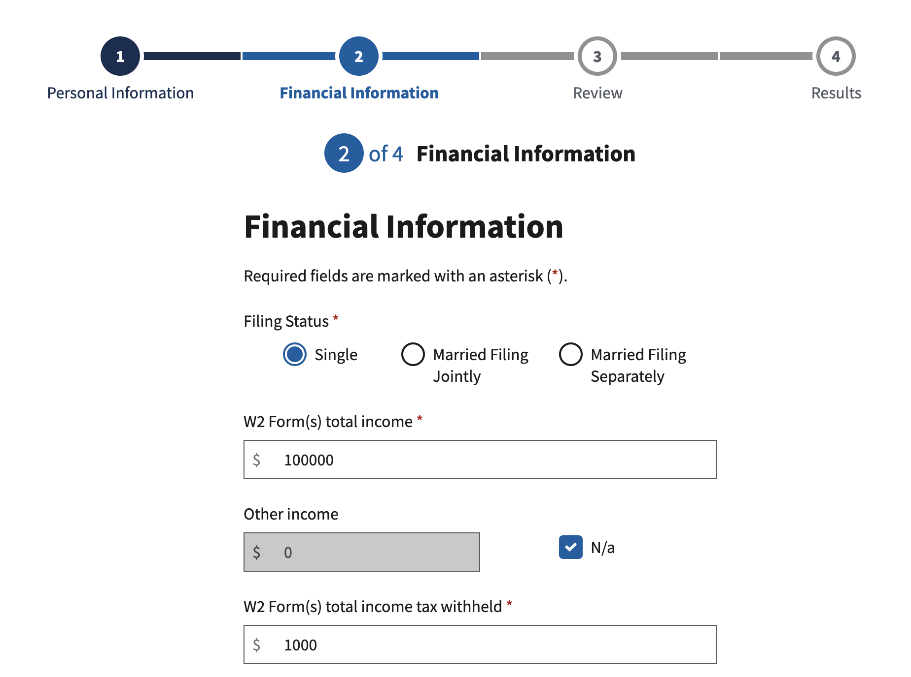
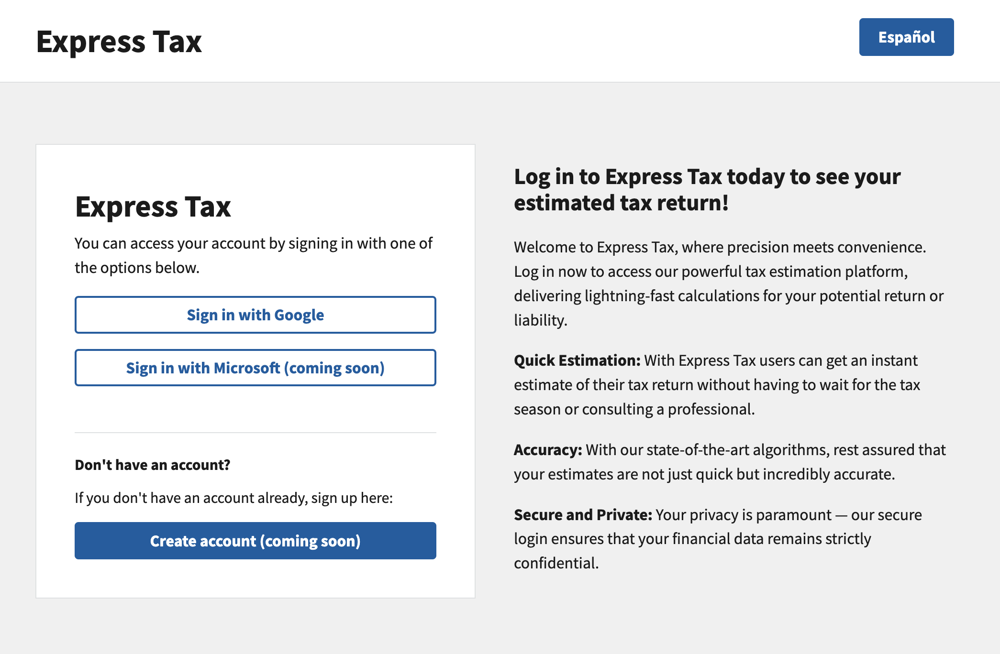
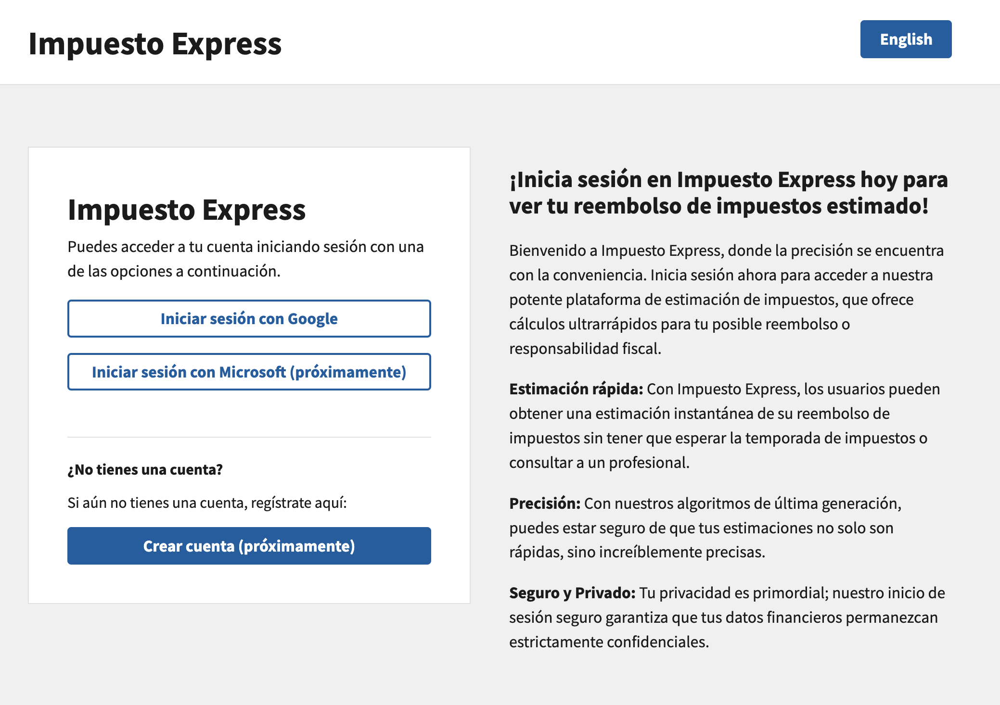

# Express Tax

## Overview

Welcome to the Express Tax application Front-End Repository! This repository houses the front-end code for the Express Tax application. Express Tax is a comprehensive tool designed to help you file your taxes efficiently and accurately. With full CRUD (Create, Read, Update, Delete) functionalities, you can manage your tax information with ease. The application also supports internationalization, allowing you to seamlessly switch between English and Spanish.

- Backend code: [click here](https://github.com/calebabutler/tax-prep-app-backend)

## Contributors:

- [Caleb Butler](https://github.com/calebabutler)
- [Andrea Bances-Monard](https://github.com/andrea1234321)

## Technologies Used:
- FrontEnd:
  - TypeScript
  - React.js
  - [Trussworks](https://trussworks.github.io/react-uswds/?path=/docs/welcome--docs)
  - [I18n](https://www.i18next.com/)

- BackEnd: 
  - Java
  - Spring Boot
  - Google OAuth
  - Spring Security
  - PostgreSQL
  - Postman
